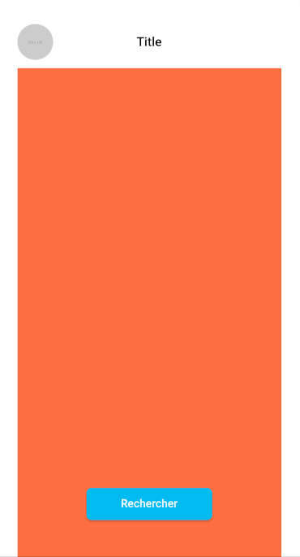
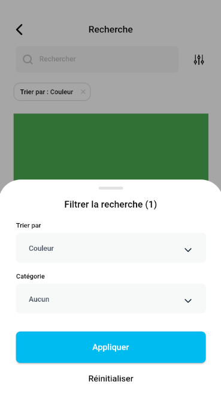

# Deploy token 
```yaml 
deployToken: deploy-token-1004985
password: pZ7VgFyAxka6bCxkxLQz

```

Fully customizable search package with infinite list of filters.
## Features





## Usage

For the TargetPage :
```dart
TargetPage(
    target: enum Target {
                iconbutton,
                searchbar,
                floatingbutton,
            }
    onPressed: target onPressed callback with your navigator.push (SearchPage() for example)
)
```

For the SearchPage :
```dart
SearchPage(
    searchBarController: TextEditingController that will contain the searchbar input
    onChanged: callback called for each searchbar changes
    result: boolean telling the SearchPage to display your child or the noResult widget (default NoResult())
)
```
You also have a onApply callback when applying filters or a onPop callback.

You can use the widget NoResult() or your own to customize the empty search placeholder or use your own :
```dart
SearchPage(
    noResult: NoResult();
)
```

For the Filters :

You can set isSettings to false if you don't want to use filters or set your own using the Filters class like so
```dart
List<Filters> filtersList = [
    Filters(
      type: 'Sort by',
      defaultValue: 'None',
      values: ['None', 'Price', 'Recent', 'Color'],
    ),
    Filters(
      type: 'Category',
      defaultValue: 'None',
      values: ['None', 'Smartphone', 'Computers'],
    ),
];
```
And then using your filters list with the SearchPage
```dart
SearchPage(
      modalFiltersList: filtersList,
)
```

Like said, to get the selected filters by the user you have the give a callback to the SearchPage, for example :
```dart
_onApply() {
    for (int i = 0; i < filtersList.length; i++) {
      print(filtersList[i].valueChoose); // valueChoose will always be equal to defaultValue at initialization or reinitialization
    }
}

SearchPage(
    onApply: _onApply,
)
```
You can also get them in the onChanged callback when the user will write an input.

## Example

[example/lib/main.dart](https://gitlab.com/KosmosDigital/widget-recherche/-/blob/master/example/lib/main.dart)

```dart
import 'package:example/test.dart';
import 'package:flutter/material.dart';
import 'package:page_transition/page_transition.dart';
import 'package:search/search.dart';

void main() {
  runApp(const MyApp());
}

class MyApp extends StatelessWidget {
  const MyApp({Key? key}) : super(key: key);

  @override
  Widget build(BuildContext context) {
    return MaterialApp(
      title: 'Search Demo',
      theme: ThemeData(
        primarySwatch: Colors.blue,
        fontFamily: 'Montserrat',
      ),
      home: const MyHomePage(title: 'Search Example'),
    );
  }
}

class MyHomePage extends StatefulWidget {
  const MyHomePage({Key? key, required this.title}) : super(key: key);

  final String title;

  @override
  State<MyHomePage> createState() => _MyHomePageState();
}

class _MyHomePageState extends State<MyHomePage> {
  @override
  Widget build(BuildContext context) {
    return TargetPage(
      target: Target.searchbar,
      avatarImage: 'https://via.placeholder.com/150/',
      title: 'Title',
      child: ListView(
        children: [
          Container(
            width: double.infinity,
            height: 700,
            color: Colors.red,
          ),
          Container(
            width: double.infinity,
            height: 700,
            color: Colors.green,
          )
        ],
      ),
      onPressed: () => Navigator.push(
        context,
        PageTransition(
          child: const Test1(),
          type: PageTransitionType.fade,
          duration: const Duration(milliseconds: 100),
        ),
      ),
    );
  }
}
```
